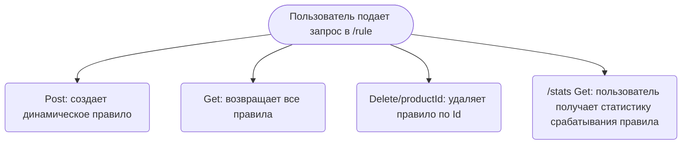
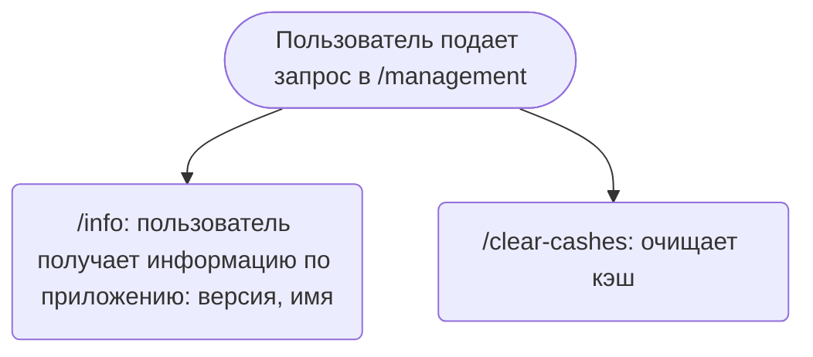
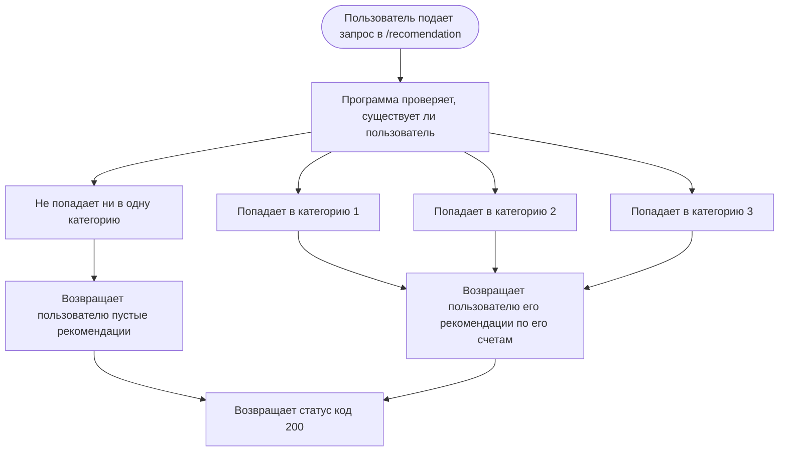
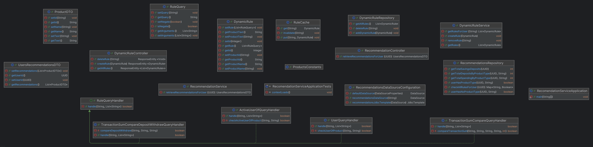

# Система финансовых рекомендаций для пользователей

## Документация

https://github.com/MariaSizz/Recomendation_Service/wiki/Главная-страница - ссылка на ¨Главную страницу¨
https://github.com/MariaSizz/Recomendation_Service/wiki/API-документация - ссылка на ¨API документацию¨

## Запуск

https://github.com/MariaSizz/Recomendation_Service/wiki/Развертывание

