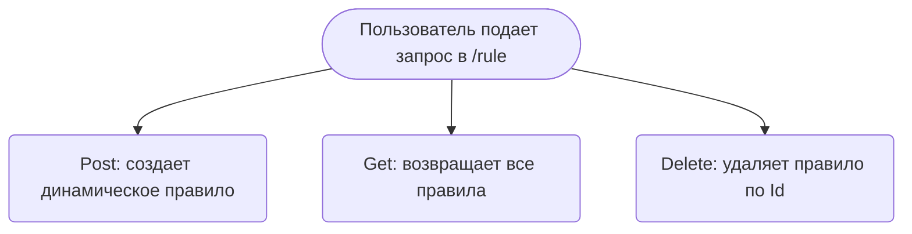

# Краткое содержание проекта
Этот сервис предназначен для предоставления рекомендаций клиентам банка.

## Основные функции
Проект включает в себя следующие функции:
- Recommendation Service: фильтрует депозиты и выводы средств пользователя и выбирает по ним нужные рекомендации.
- позволяет использовать CRUD методы для модификации динамических правил

## User Story
- Я, как пользователь нашего банка хочу получать рекомендации по кредитованию.
- Я, как пользователь программы хочу получить возможность добавлять новые правила в программу

## Functional Requirements
Наша программа позволяет по данным вывода средств и депозитов пользователя подобрать для него рекомендуемые продукты банка.
Так же добавлять свои правила для вывода рекомендаций пользователю

## Non-Functional Requirements
В нашей программе должны быть оптимизированы SQL запросы.
Добавлено кеширование на методы репозитория

## Таблица трейсинга задач 
| Задача | Готовность |
|--------|------------|
| task 1 | done       |
| task 2 | done       |

# Требования по развертыванию 
Локально:
- Клонировать проект с GitHub
- Развернуть postgres
- Настроить креды доступа postgres
